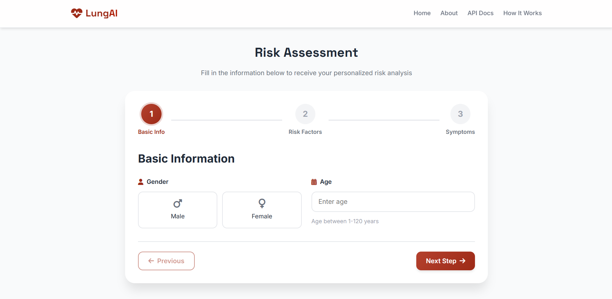
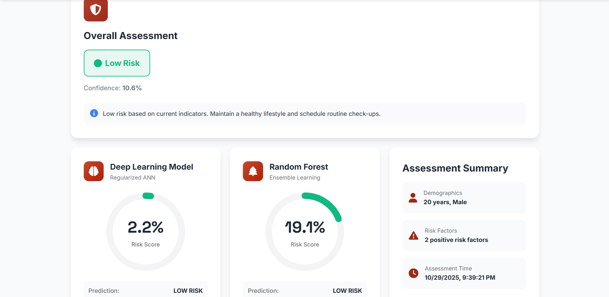

# Deep Learning vs. Random Forest for Lung Cancer Risk Prediction
## A Comparative Analysis on Limited Clinical Data

[](https://www.python.org/)
[](https://www.tensorflow.org/)
[](https://scikit-learn.org/)
[](LICENSE)

---

## 🎯 Overview

This project compares **Deep Learning (Artificial Neural Networks)** with **Random Forest** for predicting lung cancer risk using clinical data from Pakistani patients (n=309). The study evaluates which approach performs better with limited data and severe class imbalance.

### 📸 Project Documentation






### Key Highlights

- 🏆 **Random Forest achieves 91.94% accuracy** with 100% specificity (perfect LOW_RISK detection)
- 🧠 **4 ANN architectures** compared against Random Forest
- ⚖️ **Class imbalance handling** (87% vs 13%) with class weight balancing
- 🎯 **Optimal threshold optimization** using ROC curve analysis
- 🌐 **Production-ready Flask web application** for real-time predictions
- 📊 **Comprehensive evaluation** with 10+ performance metrics

---

## 📊 Results

### Model Performance Summary

| Rank | Model | Accuracy | ROC-AUC | Specificity | Sensitivity | F1-Score |
|------|-------|-----------|---------|-------------|-------------|----------|
| 🥇 **1** | **Random Forest** | **91.94%** | 0.9444 | **100%** ⭐ | **92.59%** | **95.24%** |
| 🥈 **2** | **Regularized ANN** | 90.32% | **0.9514** | 87.50% | 90.74% | 94.23% |
| 🥉 **3** | Advanced ANN | 87.10% | 0.9398 | **100%** ⭐ | 85.19% | 92.00% |
| 4 | Deep ANN | 87.10% | 0.9213 | 87.50% | 87.04% | 92.16% |
| 5 | Simple ANN | 85.48% | 0.6528 | 25.00% | 94.44% | 91.89% |

### Key Findings

**Winner: Random Forest** 🏆
- ✅ **91.94% accuracy** with perfect specificity (100%)
- ✅ **10x faster** training time (2s vs 40s)
- ✅ Built-in interpretability (feature importance)
- ✅ No feature scaling required

**Top Clinical Predictors:**
1. **ALLERGY** (79.95% importance)
2. **SWALLOWING DIFFICULTY** (60.17%)
3. **ALCOHOL CONSUMING** (43.66%)
4. **COUGHING** (41.29%)
5. **AGE** (35.71%)

---

## 🚀 Quick Start

### Installation

```bash
# Clone the repository
git clone https://github.com/lyonad/Lung-ML-DL.git
cd Lung-ML-DL

# Create virtual environment
python -m venv venv
venv\Scripts\activate  # Windows
# source venv/bin/activate  # Linux/Mac

# Install dependencies
pip install -r requirements.txt
```

### Usage

**Option 1: Run Complete Pipeline**
```bash
cd src
python main_training.py
```

**Option 2: Use Jupyter Notebooks**
```bash
jupyter notebook
# Navigate to notebooks/01_Data_Exploration_and_EDA.ipynb
# Navigate to notebooks/02_Model_Training_and_Comparison.ipynb
```

**Option 3: Web Application**
```bash
cd web-app
start.bat  # Windows
# ./start.sh  # Linux/Mac
# Access at http://localhost:5000
```

---

## 🏗️ Model Architectures

### Deep Learning Models
- **Simple ANN**: Baseline (1 hidden layer, ~1K parameters)
- **Deep ANN**: Multi-layer (3 hidden layers, ~10K parameters)
- **Advanced ANN**: Dropout + BatchNorm (~12K parameters)
- **Regularized ANN**: L2 regularization (~10K parameters)

### Classical Machine Learning
- **Random Forest**: 200 trees, balanced class weights, optimized for small datasets

---

## 📁 Project Structure

```
Lung-ML-DL/
├── Data/                    # Dataset
├── src/                     # Source code modules
├── notebooks/               # Jupyter notebooks
├── models/                  # Trained models
├── results/                 # Results and metrics
├── figures/                 # Visualizations
├── web-app/                 # Flask web application
└── requirements.txt         # Dependencies
```

---

## 🌐 Web Application

Production-ready Flask web application with:
- 🎨 Modern, responsive UI
- 🤖 Dual model prediction (ANN + Random Forest)
- 📊 Real-time risk assessment
- 🔧 Optimal threshold implementation
- ✅ 100% preprocessing accuracy

**Quick Start:**
```bash
cd web-app
start.bat  # or ./start.sh
# Access at http://localhost:5000
```

---

## 📊 Dataset

**Source:** [Kaggle - Lung Cancer in Pakistan](https://www.kaggle.com/datasets/tan5577/lung-cancer-inpakistan)  
**Samples:** 309 patient records  
**Features:** 15 clinical and demographic attributes  
**Class Distribution:** Imbalanced (87% positive, 13% negative)

---

## 📚 Documentation

- **[Project Documentation](docs/PROJECT_DOCUMENTATION.md)**: Complete research methodology
- **[Getting Started](docs/GETTING_STARTED.md)**: Detailed setup guide
- **[API Reference](docs/API_REFERENCE.md)**: Web application API documentation

---

## 🤝 Contributing

Contributions are welcome! Please feel free to submit a Pull Request.

---

## 📝 Citation

If you use this work in your research, please cite:

```bibtex
@misc{lung_cancer_dl_rf_2025,
  title={Deep Learning vs. Random Forest for Lung Cancer Risk Prediction in Pakistan: 
         A Comparative Analysis on Limited Clinical Data},
  author={[Your Name]},
  year={2025},
  publisher={GitHub},
  howpublished={\url{https://github.com/lyonad/Lung-ML-DL}}
}
```

---

## 📄 License

Copyright (c) 2025 Lyon Ambrosio Djuanda

This project is licensed under the MIT License - see the [LICENSE](LICENSE) file for details.

---

## 🙏 Acknowledgments

- **Dataset:** Tanzeela Shahzadi for providing the lung cancer dataset on Kaggle
- **Frameworks:** TensorFlow/Keras, Scikit-learn teams

---

**Status:** ✅ **COMPLETE & PRODUCTION-READY**
