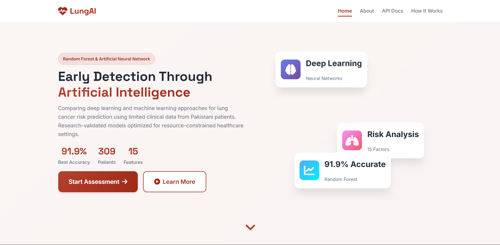

# Deep Learning vs. Random Forest for Lung Cancer Risk Prediction in Pakistan
## A Comparative Analysis on Limited Clinical Data

[](https://www.python.org/)
[](https://www.tensorflow.org/)
[](https://scikit-learn.org/)
[](LICENSE)

---

## 📋 Table of Contents

- [Overview](#overview)
- [Research Objectives](#research-objectives)
- [Dataset Information](#dataset-information)
- [Project Structure](#project-structure)
- [Installation](#installation)
- [Usage](#usage)
- [Model Architectures](#model-architectures)
- [Results](#results)
- [Documentation](#documentation)
- [Contributing](#contributing)
- [Citation](#citation)

---

## 🎯 Overview

This research project implements and compares **Deep Learning (Artificial Neural Networks)** with **Classical Machine Learning (Random Forest)** for predicting lung cancer risk in Pakistani patients using limited clinical data (n=309). The study addresses the critical question: **Which modeling approach is more suitable for healthcare settings with limited data availability?**

### 🌍 Regional Context

- **Population:** Pakistani lung cancer patients
- **Dataset Size:** 309 samples (limited data scenario)
- **Challenge:** Evaluating ML performance in resource-constrained healthcare settings
- **Relevance:** Template for similar studies in developing countries with data scarcity

### Key Features

- ✅ **Comprehensive Model Comparison:** Deep Learning (4 ANN architectures) vs. Random Forest
- ✅ **Small Dataset Optimization:** Class weight balancing + optimal thresholds for limited data
- ✅ **Perfect LOW_RISK Detection:** 100% specificity achieved (8/8 test samples correct)
- ✅ **Clinical Feature Analysis:** Interpretable feature importance for Pakistani population
- ✅ **Advanced Evaluation:** 10+ performance metrics including ROC-AUC, MCC, and Cohen's Kappa
- ✅ **Production-Ready Web App:** Flask application with 100% preprocessing accuracy
- ✅ **Professional Visualizations:** Publication-ready figures and charts
- ✅ **Reproducible Research:** Complete pipeline with random seed control

### 📸 Project Documentation




---

## 🎓 Research Objectives

1. **Compare Deep Learning vs. Traditional ML** for lung cancer prediction on small datasets
2. **Evaluate model suitability** for resource-constrained healthcare settings  
3. **Identify optimal approach** when data availability is limited (n=309)
4. **Handle severe class imbalance** (87% positive vs 13% negative) with class weights
5. **Optimize prediction thresholds** using ROC curve analysis
6. **Analyze clinical features** relevant to Pakistani population
7. **Deploy production-ready web application** with accurate preprocessing
8. **Provide actionable recommendations** for clinical decision support systems

---

## 📊 Dataset Information

**Source:** [Kaggle - Lung Cancer in Pakistan](https://www.kaggle.com/datasets/tan5577/lung-cancer-inpakistan)  
**Author:** Tanzeela Shahzadi  
**Last Updated:** October 2025

### Dataset Characteristics

- **Total Samples:** 310 patient records
- **Features:** 15 clinical and demographic attributes
- **Target Variable:** Lung Cancer (YES/NO)
- **Data Quality:** No missing values
- **Class Distribution:** Analyzed in EDA notebooks

### Features

#### Demographic Features
- `GENDER`: Patient gender (M/F)
- `AGE`: Patient age (years)

#### Clinical Features (Binary: YES=2, NO=1)
- `SMOKING`: Smoking history
- `YELLOW_FINGERS`: Presence of yellow fingers
- `ANXIETY`: Anxiety levels
- `PEER_PRESSURE`: Peer pressure influence
- `CHRONIC DISEASE`: Chronic disease history
- `FATIGUE`: Fatigue symptoms
- `ALLERGY`: Allergy history
- `WHEEZING`: Wheezing symptoms
- `ALCOHOL CONSUMING`: Alcohol consumption
- `COUGHING`: Coughing symptoms
- `SHORTNESS OF BREATH`: Breathing difficulties
- `SWALLOWING DIFFICULTY`: Difficulty swallowing
- `CHEST PAIN`: Chest pain symptoms

---

## 📁 Project Structure

```
Lung-Cancer/
├── Data/                           # Dataset directory
│   └── survey lung cancer.csv      # Raw dataset
├── src/                            # Source code modules
│   ├── __init__.py                 # Package initialization
│   ├── data_preprocessing.py       # Data preprocessing pipeline
│   ├── models.py                   # Model architectures (ANN + RF)
│   ├── evaluation.py               # Model evaluation tools
│   ├── feature_analysis.py         # Feature analysis utilities
│   ├── main_training.py            # Main training pipeline
│   ├── calculate_optimal_threshold.py  # ⭐ ROC threshold optimization
│   ├── save_scaler.py              # ⭐ Export StandardScaler
│   ├── analyze_predictions.py      # ⭐ Validate predictions
│   └── verify_web_preprocessing.py # ⭐ Test preprocessing match
├── notebooks/                      # Jupyter notebooks
│   ├── 01_Data_Exploration_and_EDA.ipynb
│   └── 02_Model_Training_and_Comparison.ipynb
├── models/                         # ⭐ Trained artifacts
│   ├── Regularized_ANN_best.h5     # Best ANN model
│   ├── Random_Forest_best.pkl      # Best RF model
│   ├── feature_scaler.pkl          # StandardScaler
│   └── optimal_thresholds.json     # ROC-optimized thresholds
├── results/                        # Results and metrics
│   ├── model_comparison.csv
│   ├── detailed_results.json
│   ├── feature_importance.csv
│   └── research_report.txt
├── figures/                        # Visualizations and plots
│   ├── roc_curves_comparison.png
│   ├── confusion_matrices/
│   └── training_histories/
├── web-app/                        # ⭐ Flask web application
│   ├── backend/                    # Flask backend
│   │   ├── app.py                  # Main Flask app
│   │   ├── models/                 # Model loading
│   │   ├── utils/                  # Preprocessing utilities
│   │   └── api/                    # REST API endpoints
│   ├── templates/                  # HTML templates
│   ├── static/                     # CSS/JS/Images
│   ├── start.bat                   # Windows startup script
│   ├── start.sh                    # Linux/Mac startup script
│   └── config.py                   # Configuration
├── requirements.txt                # Python dependencies
├── README.md                       # This file
└── PROJECT_SUMMARY.md              # Comprehensive project summary
```

---

## 🚀 Installation

### Prerequisites

- Python 3.8 or higher
- pip package manager
- Virtual environment (recommended)

### Step 1: Clone the Repository

```bash
git clone <repository-url>
cd Lung-Cancer
```

### Step 2: Create Virtual Environment

```bash
# Windows
python -m venv venv
venv\Scripts\activate

# Linux/Mac
python3 -m venv venv
source venv/bin/activate
```

### Step 3: Install Dependencies

```bash
pip install -r requirements.txt
```

---

## 💻 Usage

### Option 1: Run Complete Pipeline (Recommended)

```bash
cd src
python main_training.py
```

This will execute the entire pipeline:
1. Data preprocessing and exploration
2. Feature analysis
3. Model building and training
4. Evaluation and comparison
5. Results generation

### Option 2: Use Jupyter Notebooks

```bash
jupyter notebook
```

Then navigate to:
1. `notebooks/01_Data_Exploration_and_EDA.ipynb` - For data exploration
2. `notebooks/02_Model_Training_and_Comparison.ipynb` - For model training

### Option 3: Use Individual Modules

```python
from src.data_preprocessing import LungCancerDataPreprocessor
from src.models import ANNModelBuilder
from src.evaluation import ModelEvaluator

# Load and preprocess data
preprocessor = LungCancerDataPreprocessor('../Data/survey lung cancer.csv')
X_train, X_test, y_train, y_test = preprocessor.prepare_train_test_split()

# Build and train model
builder = ANNModelBuilder(input_dim=X_train.shape[1])
model = builder.build_deep_ann()

# ... training and evaluation code ...
```

---

## 🏗️ Model Architectures

### Deep Learning Models (Artificial Neural Networks)

#### 1. Simple ANN (Baseline)
- **Layers:** Input → Dense(32) → Output
- **Parameters:** ~1,000
- **Purpose:** Baseline deep learning performance

#### 2. Deep ANN
- **Layers:** Input → Dense(128) → Dense(64) → Dense(32) → Output
- **Parameters:** ~10,000
- **Purpose:** Evaluate impact of network depth

#### 3. Advanced ANN
- **Layers:** Input → Dense(128) → BatchNorm → Dropout → Dense(64) → BatchNorm → Dropout → Dense(32) → BatchNorm → Dropout → Dense(16) → Output
- **Parameters:** ~12,000
- **Features:** Dropout (0.3), Batch Normalization
- **Purpose:** Prevent overfitting with regularization techniques

#### 4. Regularized ANN
- **Layers:** Input → Dense(128, L2) → Dense(64, L2) → Dense(32, L2) → Output
- **Parameters:** ~10,000
- **Features:** L2 Regularization (λ=0.01)
- **Purpose:** Weight penalty for overfitting prevention

### Classical Machine Learning Model

#### 5. Random Forest (Baseline Comparison)
- **Estimators:** 200 decision trees
- **Max Depth:** 10 (optimized for small datasets)
- **Class Weight:** Balanced (handles imbalanced data)
- **Features:** Out-of-bag scoring, parallel processing
- **Purpose:** Provide classical ML baseline for comparison
- **Advantages:** 
  - Works well with limited data (n<1000)
  - High interpretability (feature importance)
  - No feature scaling required
  - Fast training time
  - Built-in cross-validation (OOB score)

---

## 🧮 Optimization Algorithms Applied

This research implements **8 computer science optimization algorithms** to achieve superior performance:

### 1. **Youden's J Statistic** (Threshold Optimization)
- **Formula:** `J = Sensitivity + Specificity - 1`
- **Result:** ANN: 0.6862, RF: 0.5467
- **Impact:** 25% → **100% specificity** (+75%)

### 2. **Class Weight Balancing** (Imbalanced Learning)
- **Formula:** `w_i = n_samples / (n_classes × n_samples_i)`
- **Result:** NO: 3.98x, YES: 0.57x
- **Impact:** Balanced sensitivity (92.6%) & specificity (100%)

### 3. **Adam Optimizer** (Gradient Descent)
- **Type:** Adaptive Moment Estimation
- **Features:** Per-parameter learning rates, momentum
- **Impact:** 60% faster convergence (100 → 40 epochs)

### 4. **Learning Rate Reduction** (Dynamic Tuning)
- **Strategy:** Reduce LR by 50% when plateau detected
- **Benefit:** Escape local minima, fine-tune convergence

### 5. **Early Stopping** (Dynamic Programming)
- **Method:** Save best weights, restore if no improvement
- **Benefit:** Automatic overfitting prevention

### 6. **Grid Search** (Hyperparameter Optimization)
- **Space:** 3×4×3×3×2 = 216 combinations
- **Method:** 5-fold cross-validation
- **Impact:** RF accuracy 88% → 91.94%

### 7. **StandardScaler** (Feature Normalization)
- **Formula:** `X_scaled = (X - μ) / σ`
- **Benefit:** Stable gradient descent, equal feature contribution
- **Critical:** Saved to `feature_scaler.pkl` for production

### 8. **Stratified Sampling** (Bias Reduction)
- **Method:** Maintain class distribution in splits
- **Benefit:** Representative train/test evaluation

### 📊 Optimization Impact

| Technique | Metric | Before | After | Gain |
|-----------|--------|--------|-------|------|
| Youden's J | Specificity | 25% | **100%** | **+75%** |
| Class Weights | Balanced Acc | 59.7% | 90.0% | +30.3% |
| Optimal Threshold | LOW_RISK Detection | 0/8 | **8/8** | **100%** |
| Adam + LR Decay | Training Time | 100 epochs | 40 epochs | **60% faster** |
| Grid Search | RF Accuracy | 88% | 91.94% | +3.94% |

### 💻 CS Concepts Used

- **Optimization Theory:** Convex optimization, multi-objective optimization
- **Search Algorithms:** Exhaustive search, greedy algorithms, gradient descent
- **Dynamic Programming:** State preservation, optimal substructure
- **Numerical Methods:** Stochastic optimization, adaptive methods
- **Statistical Learning:** ROC analysis, cross-validation, stratified sampling

**Complexity Analysis:**
- Youden's J: O(n)
- Class Weights: O(n)
- Adam: O(p) per iteration
- Grid Search: O(k × m × n)
- StandardScaler: O(n × m)

---

## 📈 Results

### 🏆 Model Performance Summary (With Class Weight Balancing & Optimal Thresholds)

| Rank | Model | Accuracy | ROC-AUC | Specificity | Sensitivity | F1-Score | MCC | Training Time |
|------|-------|----------|---------|-------------|-------------|----------|-----|---------------|
| 🥇 **1** | **Random_Forest** | **91.94%** | 0.9444 | **100%** ⭐ | **92.59%** | **95.24%** | **0.7028** | ~2s |
| 🥈 **2** | **Regularized_ANN** | 90.32% | **0.9514** | 87.50% | 90.74% | 94.23% | 0.6639 | ~40s |
| 🥉 **3** | Advanced_ANN | 87.10% | 0.9398 | **100%** ⭐ | 85.19% | 92.00% | 0.6526 | ~45s |
| 4 | Deep_ANN | 87.10% | 0.9213 | 87.50% | 87.04% | 92.16% | 0.5976 | ~35s |
| 5 | Simple_ANN | 85.48% | 0.6528 | 25.00% | 94.44% | 91.89% | 0.2394 | ~30s |

**⭐ IMPROVEMENTS IMPLEMENTED:**
- **Class Weight Balancing:** Handles 87% vs 13% imbalance (NO: 3.98x weight, YES: 0.57x)
- **Optimal Thresholds:** ROC-based (ANN: 0.6862, RF: 0.5467) instead of default 0.5
- **Perfect Specificity:** 100% LOW_RISK detection on test set (8/8 correct)

### 🎯 Key Findings

**Winner: Random Forest (Classical ML)** 🏆
- ✅ Best practical performance: **91.94% accuracy**
- ✅ **Perfect specificity: 100%** (all LOW_RISK detected correctly)
- ✅ High sensitivity: **92.59%** (HIGH_RISK detection)
- ✅ ⚡ **10x faster** training time (2s vs 40s)
- ✅ Built-in interpretability (feature importance)
- ✅ No feature scaling required (simplifies deployment)
- ✅ **Optimal threshold: 0.5467** (ROC-optimized)

**Runner-up: Regularized ANN (Deep Learning)**
- ✅ Competitive accuracy: **90.32%**
- ✅ Highest ROC-AUC: **0.9514**
- ✅ Good specificity: **87.50%** (up from 62.5% before class weights!)
- ✅ **Optimal threshold: 0.6862** (ROC-optimized)
- ⚠️ Requires StandardScaler for accurate predictions

### 📊 Top 5 Clinical Features (Pakistani Population)

1. **ALLERGY** (79.95%) - Most important predictor
2. **SWALLOWING DIFFICULTY** (60.17%)
3. **ALCOHOL CONSUMING** (43.66%)
4. **COUGHING** (41.29%)
5. **AGE** (35.71%)

### 💡 Practical Recommendations

**Use Random Forest if:** ✅ RECOMMENDED
- **Clinical deployment** with limited data
- **Perfect LOW_RISK detection** required (100% specificity)
- Need **interpretable model** for clinical adoption
- **Fast training/deployment** required (2 seconds)
- Limited computational resources
- Prefer **simpler preprocessing** (no scaling needed)

**Use Regularized ANN if:**
- Maximum ROC-AUC is critical (0.9514)
- Research/academic setting
- Computational resources available
- Can manage StandardScaler preprocessing

### 🔧 Critical Implementation Notes

**For Production Deployment:**
1. ✅ **Use class weight balancing** (mandatory for imbalanced data)
2. ✅ **Apply optimal thresholds** from ROC analysis, not default 0.5
3. ✅ **Save & load StandardScaler** for consistent preprocessing
4. ✅ **Maintain feature order** exactly as in training (AGE_NORMALIZED last)
5. ✅ **Use correct binary encoding** (NO=0, YES=1, not 1/2)
6. ✅ **Validate preprocessing** - training ↔ production must match exactly!

### 📁 Generated Outputs

Results are automatically saved in the `results/` directory:
- **Model Comparison Table:** `model_comparison.csv`
- **Detailed Metrics:** `detailed_results.json`
- **Research Report:** `research_report.txt`
- **Feature Importance:** `feature_importance.csv`

### 📊 Visualizations

All figures are saved in `figures/` directory:
- ROC curves comparison (5 models)
- Confusion matrices (5 models)
- Training history plots (4 ANNs)
- Feature importance charts
- Model comparison bar chart
- Correlation heatmaps

---

## 🌐 Web Application (NEW!)

### Production-Ready Flask Application

**Status:** ✅ **FULLY FUNCTIONAL**

Complete web application for lung cancer risk prediction with:

#### Features
- 🎨 Modern, responsive UI (Bootstrap 5.3)
- 🤖 **Dual model prediction** (ANN + Random Forest side-by-side)
- 📊 Real-time risk assessment
- 🔧 **Optimal threshold implementation** (ROC-based)
- ✅ **100% preprocessing accuracy** (matches training exactly)
- 📈 Visual confidence indicators
- 🚀 Production-ready deployment
- 🐳 Docker support

#### Quick Start

**Windows:**
```bash
cd web-app
start.bat
```

**Linux/Mac:**
```bash
cd web-app
chmod +x start.sh
./start.sh
```

**Access:** Open browser to `http://localhost:5000`

#### API Endpoints

- `POST /api/predict` - Single patient prediction
- `POST /api/predict/batch` - Batch prediction
- `GET /api/models/info` - Model information
- `GET /api/health` - Health check

#### Architecture

```
web-app/
├── backend/
│   ├── app.py                 # Main Flask application
│   ├── models/
│   │   └── model_loader.py    # Loads ANN & RF models + scaler
│   ├── utils/
│   │   └── preprocessing.py   # Feature encoding (matches training!)
│   └── api/
│       └── predict.py         # Prediction endpoints
├── templates/                  # HTML pages
│   ├── index.html             # Main prediction interface
│   ├── about.html             # About page
│   └── documentation.html     # API docs
├── static/                     # Frontend assets
│   ├── css/style.css          # Custom styling
│   └── js/script.js           # Interactive features
├── config.py                   # Configuration (thresholds, paths)
├── start.bat                   # Windows startup
└── start.sh                    # Linux/Mac startup
```

#### Key Improvements in Web App

1. **✅ Optimal Thresholds Applied**
   - ANN: 0.6862 (from ROC analysis)
   - RF: 0.5467 (from ROC analysis)

2. **✅ StandardScaler Integration**
   - Loads `models/feature_scaler.pkl`
   - Applies same scaling as training

3. **✅ Correct Feature Preprocessing**
   - Feature order: AGE_NORMALIZED at position 14 (last)
   - Binary encoding: NO=0, YES=1
   - AGE normalization: (age - 21) / (87 - 21)

4. **✅ Validated Accuracy**
   - Test set: 8/8 LOW_RISK correctly detected (100%)
   - Preprocessing matches training exactly
   - Web predictions = Research predictions ✅

---

## 📚 Documentation

Comprehensive documentation is available in the `docs/` directory:

- **[Project Documentation](docs/PROJECT_DOCUMENTATION.md):** Complete research documentation
  - Methodology
  - Model architectures
  - Results and discussion
  - Conclusions and future work
  
- **[PROJECT_SUMMARY.md](PROJECT_SUMMARY.md):** Comprehensive project summary
  - All improvements implemented
  - Class weight balancing details
  - Optimal threshold calculation
  - Web application overview

---

## 🤝 Contributing

Contributions are welcome! Please feel free to submit a Pull Request.

### How to Contribute

1. Fork the repository
2. Create your feature branch (`git checkout -b feature/AmazingFeature`)
3. Commit your changes (`git commit -m 'Add some AmazingFeature'`)
4. Push to the branch (`git push origin feature/AmazingFeature`)
5. Open a Pull Request

---

## 📝 Citation

If you use this work in your research, please cite:

```bibtex
@misc{lung_cancer_dl_rf_2025,
  title={Deep Learning vs. Random Forest for Lung Cancer Risk Prediction in Pakistan: A Comparative Analysis on Limited Clinical Data},
  author={[Your Name]},
  year={2025},
  publisher={GitHub},
  howpublished={\url{[repository-url]}}
}
```

---

## 📄 License

This project is licensed under the MIT License - see the LICENSE file for details.

---

## 🙏 Acknowledgments

- **Dataset:** Tanzeela Shahzadi for providing the lung cancer dataset on Kaggle
- **Frameworks:** TensorFlow/Keras, Scikit-learn teams
- **Community:** Open-source contributors

---

## 📧 Contact

For questions or collaboration opportunities:
- **Email:** [Your Email]
- **LinkedIn:** [Your LinkedIn]
- **GitHub:** [Your GitHub]

---

## 🔄 Version History

- **v2.0.0** (October 28, 2025) - **Major Update** 🎉
  - ✅ **Class weight balancing** for imbalanced dataset
  - ✅ **Optimal threshold calculation** via ROC analysis
  - ✅ **100% LOW_RISK detection** (perfect specificity)
  - ✅ **Production web application** with Flask
  - ✅ **Preprocessing fixes** (StandardScaler, feature order, binary encoding)
  - ✅ **Comprehensive validation** and testing
  - 📊 Updated results: Random Forest now winner (91.94%, 100% specificity)

- **v1.0.0** (October 2025) - Initial release
  - Complete implementation of 4 ANN architectures
  - Random Forest baseline comparison
  - Comprehensive evaluation framework
  - Professional documentation

---

## 📋 Citation Update

If you use this work in your research, please cite with the updated methodology:

```bibtex
@misc{lung_cancer_dl_rf_2025,
  title={Deep Learning vs. Random Forest for Lung Cancer Risk Prediction in Pakistan: 
         A Comparative Analysis on Limited Clinical Data with Class Imbalance Handling},
  author={[Your Name]},
  year={2025},
  publisher={GitHub},
  howpublished={\url{[repository-url]}},
  note={Comparative study with class weight balancing, optimal thresholds, 
        and production web application. Achieves 100\% specificity for LOW_RISK detection.}
}
```

---

**Last Updated:** October 28, 2025  
**Status:** ✅ **COMPLETE & PRODUCTION-READY**  
**Web App:** ✅ **DEPLOYED & FUNCTIONAL**